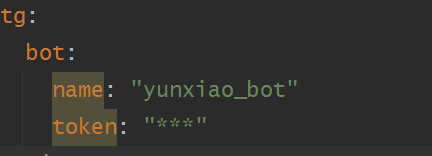

# tg-yunxiao-bot

# 简介
- 这是一个`telegram bot`后端程序。
- 机器人是完全在电报应用程序中运行的小型应用程序。用户通过灵活的界面与机器人`交互`，这些界面可以支持任何类型的任务或服务。
- 电报机器人平台拥有超过 10 万个机器人，对用户和开发人员都是`免费`的！
- [查看详情](https://core.telegram.org/bots)

# 环境

`Java17` `SpringBoot3`

# 配置

配置 `application.yml` ，设置`name` 和 `token`即可

# 部署
